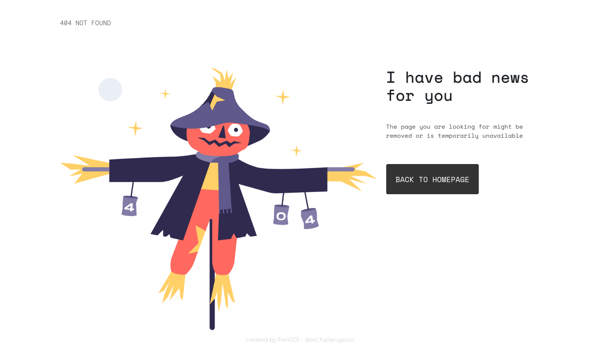

<!-- Please update value in the {}  -->

<h1 align="center">{404 Page}</h1>

   Solution for a challenge from  <a href="http://devchallenges.io" target="_blank">Devchallenges.io</a>.

  <h3>
    <a href="https://{https://404-page-per001.netlify.app/}">
      Demo
    </a>
     | 
    <a href="https://{https://github.com/Pericles001/404.git}">
      Solution
    </a>
     | 
    <a href="https://devchallenges.io/challenges/wBunSb7FPrIepJZAg0sY">
      Challenge
    </a>
  </h3>

<!-- TABLE OF CONTENTS -->

## Table of Contents

-   [Overview](#overview)
    -   [Built With](#built-with)
-   [Features](#features)
-   [Contact](#contact)
-   [Acknowledgements](#acknowledgements)

<!-- OVERVIEW -->

## Overview

-   You can see the [demo](https://404-page-per001.netlify.app/) there
-   My experience was to create a web page based on figma file
-   I improved my skills in responsivity management
-   If you want to help me improve this, just go ahead :)

### Built With

<!-- This section should list any major frameworks that you built your project using. Here are a few examples.-->

-   [HTML](https://developer.mozilla.org/fr/docs/Web/HTML)
-   [CSS](https://developer.mozilla.org/fr/docs/Web/CSS)
-   [Bootstrap](https://getbootstrap.com/)

## Features

<!-- List the features of your application or follow the template. Don't share the figma file here :) -->

This application/site was created as a submission to a [DevChallenges](https://devchallenges.io/challenges) challenge. The [challenge](https://devchallenges.io/challenges/wBunSb7FPrIepJZAg0sY) was to build an application to complete the given user stories.

## Acknowledgements

<!-- This section should list any articles or add-ons/plugins that helps you to complete the project. This is optional but it will help you in the future. For exmpale -->

-   [Steps to replicate a design with only HTML and CSS](https://devchallenges-blogs.web.app/how-to-replicate-design/)
-   [ deploy on Netlify](https://app.netlify.com/)
-   [Marked - a markdown parser](https://github.com/chjj/marked)

## Contact

-   GitHub [Pericles001](https://github.com/Pericles001)
-   Twitter [@your-twitter](https://github.com/Pericles001)
